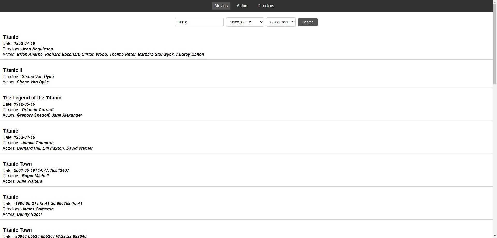

# Movie Search App



## Table of Contents

- [About](#about)
- [Getting Started](#getting-started)
    - [Prerequisites](#prerequisites)
    - [Installation](#installation)
- [Usage](#usage)
- [Running the Server](#running-the-server)
- [Data Source](#data-source)
- [Contributing](#contributing)
- [License](#license)
- [Contact](#contact)

## About

The Movie Search App is a web application that allows users to search for movies, actors, and directors. It provides a simple and intuitive interface to explore information from DBpedia, a crowd-sourced knowledge graph containing structured information about various entities.

Main features of the Movie Search App:
- Search for movies, actors, and directors.
- View detailed information about each movie, including its cast and crew.
- Discover related movies, actors, and directors.
- Explore rich metadata and interesting facts about movies and individuals.

## Getting Started

### Prerequisites

Before running the Movie Search App, make sure you have the following software installed:

- [Node.js](https://nodejs.org) (version 18.17.0 or higher)
- [npm](https://www.npmjs.com/get-npm) (version 9.6.7 or higher)

### Installation

Follow these steps to set up the project locally:

1. Clone the repository:

```bash
git clone https://github.com/simeonmarkoski/movies-search-rdf-app.git
```

2. Change directory:

```bash
cd movie-search-app
```

3. Install dependencies:

```bash
npm install
```

### Usage

To start the Movie Search App, run the following command:

```bash
npm start
```

This will launch the app on http://localhost:3000 in your web browser.

Use the search bar to look up movies, actors, or directors. Click on the search results to view detailed information about each entity. The app provides an interactive and engaging way to explore the world of movies and the people behind them.

### Running the Server
The Movie Search App interacts with DBpedia to fetch data. To run the server that connects to DBpedia, use the following command:

```bash
node server.js
```

This will start the server on http://localhost:5000.

Please ensure that the server is running before using the app.

### Data Source

The Movie Search App retrieves information from DBpedia, a community-driven project that extracts structured content from Wikipedia and makes it available as a knowledge graph. DBpedia covers various domains, including movies, actors, directors, and more. The app utilizes this data to provide users with valuable insights into the entertainment industry.

### Contributing

We welcome contributions from the community! If you want to contribute to this project, follow these steps:

1. Fork the repository.
2. Create a new branch: <b>\`git checkout -b feature/your-feature-name\`</b>.
3. Make your changes and commit them: <b>\`git commit -m 'Add some feature'\`</b>.
4. Push to the branch: <b>\`git push origin feature/your-feature-name\`</b>.
5. Open a pull request and describe your changes.

Please read our Contribution Guidelines for more details.

### License
This project is licensed under the <u><b>MIT License</b></u>.

### Contact

For any questions or feedback, feel free to reach out to us:

- Your Name: [simeonmarkoski10@gmail.com](mailto:simeonmarkoski10@gmail.com)
- Project Repository: [https://github.com/simeonmarkoski/movies-search-rdf-app](https://github.com/simeonmarkoski/movies-search-rdf-app)
- Issue Tracker: [https://github.com/simeonmarkoski/movies-search-rdf-app/issues](https://github.com/simeonmarkoski/movies-search-rdf-app/issues)